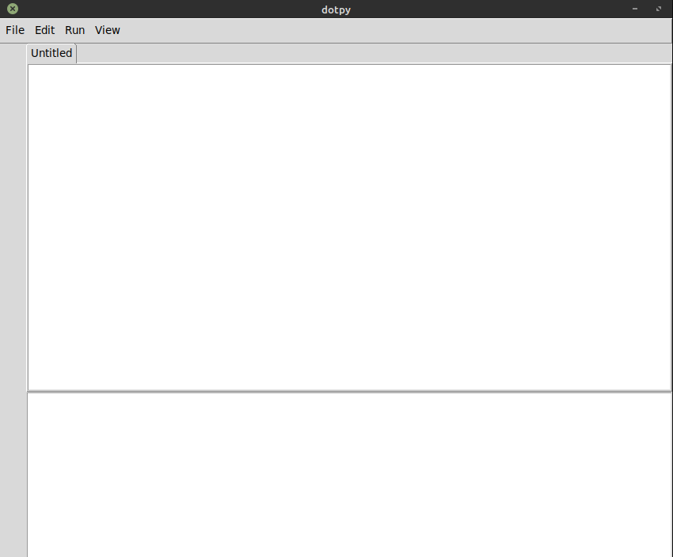
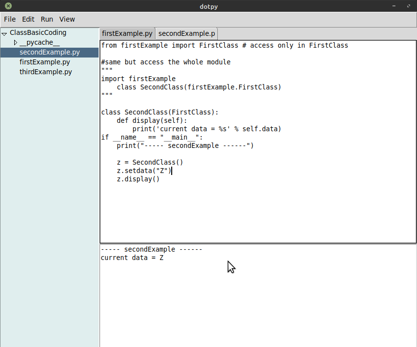

dotpy is an IDE application for Python 3, build using Tkinter GUI toolkit. This project is inspired by Python IDLE also written in Python and Tkinter GUI toolkit.

## Features include:

- Creating new file, opening existing file, editing and saving file.
- Open Folder/Project, show/hide the list of the opened folder/project and able to select or open a file from the list.
- Implementing tabs for opened file and able to close tab.
- Implementing common editing option such as cut,past,undo,redo, clear all and select all.
- Run python 3, show output code/error and highlight the error
- Remember the open tabs when closing the application.

## Tkinter Widgets that I used:

- Menu
- Notebook
- Frame
- Text

## Modules 
- os
- tkinter
- subprocess

## Demo Link
Run the code live in your browser make sure to run it on fullscreen: 
https://replit.com/@m-dennisgocong/dotpy#main.py 


## Run Locally

Clone the project

```bash
  git clone https://github.com/m-dennisgocong/dotpy.git
```
Go to the project directory

```bash
  cd dotpy
```
Run the file

```bash
  python3 dotpy.py
```
## Dependency
Surely all the modules are preinstall with Python installer, if not you can install them manually using pip install.

## Screenshots



## Contribution
If you find any bug in the code or have any improvements in mind feel free to generate a pull request.
